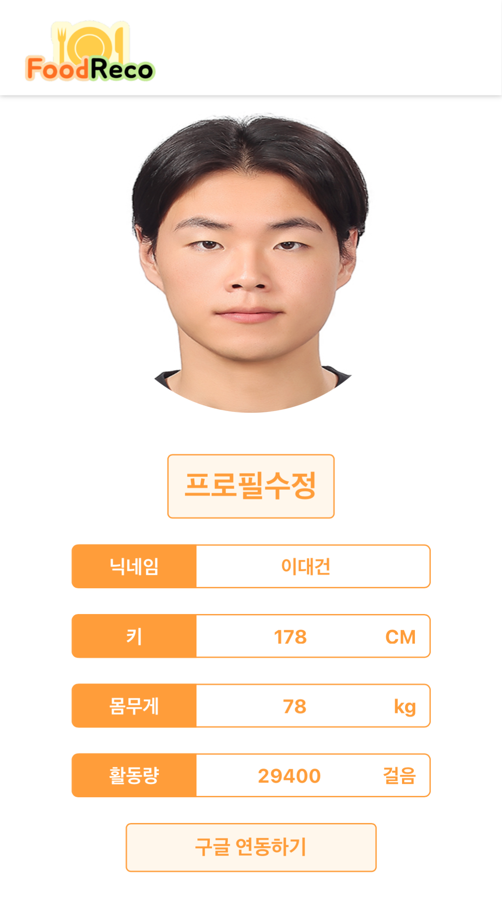
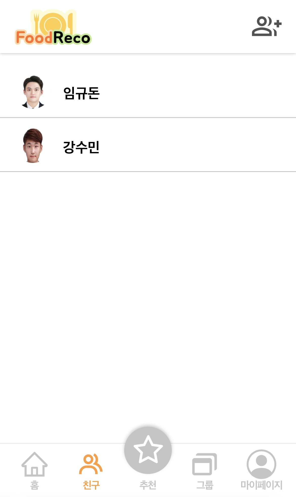
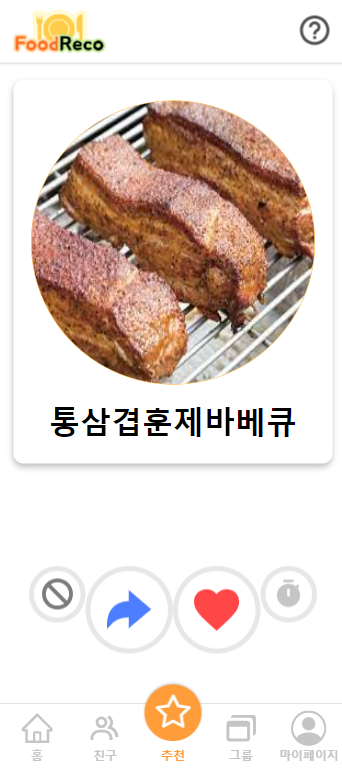
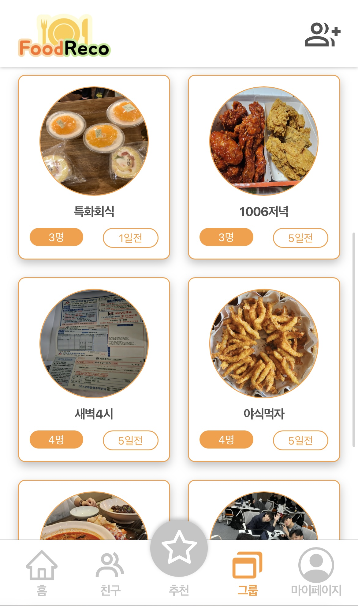
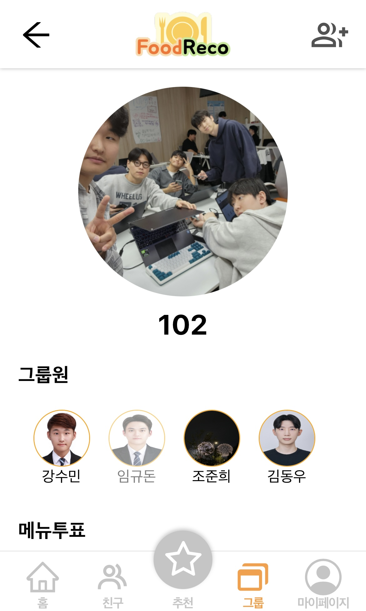
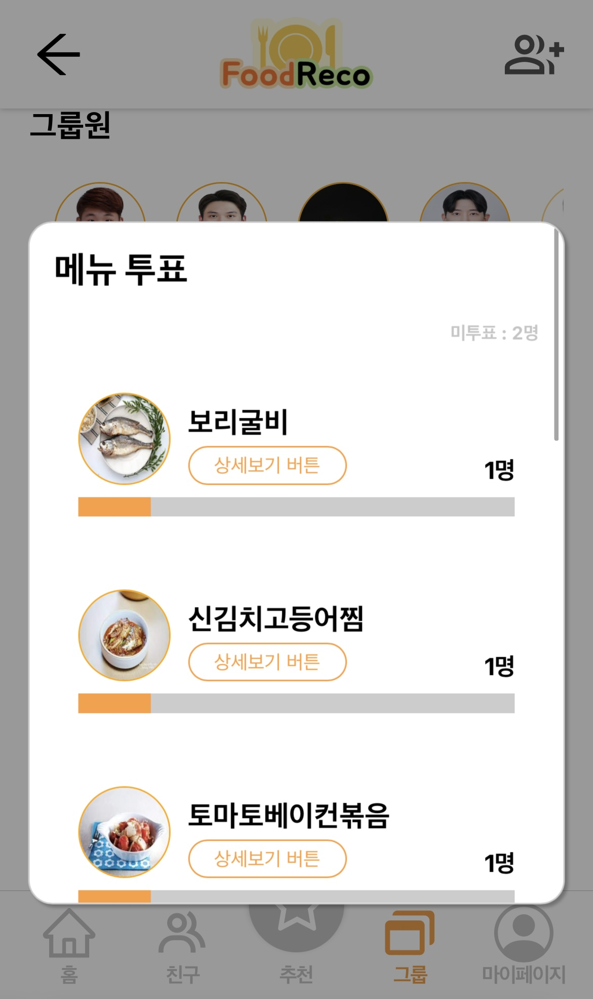
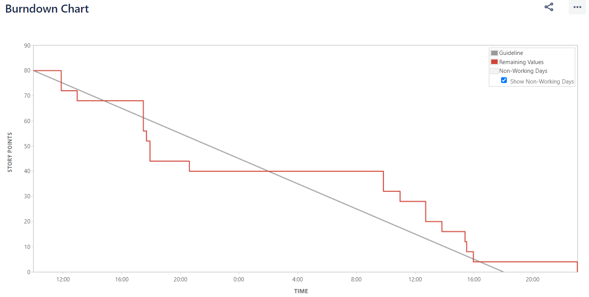

# SAFFY 특화 프로젝트: Food Reco

  

## 개발 기간

- 2023년 8월 25일 ~ 2023년 10월 6일

## 팀

### Spring boot 백엔드

- 이대건
  - fastAPI 추천 시스템 개발
  - 음식 빅데이터 전처리
  - spring boot와 fastAPI 통신
  - spring 서버에서 추천 결과 후처리(필터링)
  - 구글 OAuth2.0 권한 연동
  - google fitness API를 통해 유저 정보 수집
- 조준희
- 임규돈

### 프론트엔드

- 강수민(팀장)
- 김동우

## Food Reco란?

- 사용자의 취향에 맞춘 메뉴 추천 시스템입니다.

## 기존 메뉴 추천 시스템

- 개인이 먹을 음식만을 추천하여 여럿이서 먹을 때 도움을 주지 못합니다.

## Food Reco

- 마이페이지 및 친구, 개인 음식 추천

  
  

- 그룹 참가 및 그룹 상세페이지, 투표 페이지

  
    
    

- 구글 피트니스 연동을 통해 개인의 활동량 데이터를 받습니다.
- 개인 음식 피드백 점수, 날씨, 활동량, 재료를 기반으로 사전에 학습시킨 TF-IDF 벡터의 코사인 유사도를 비교하여 음식을 추천합니다.
- 추천 알고리즘 결과중 특정 음식이 알러지 재료를 포함하거나, 차단 또는 최근에 먹은 음식이 있다면 필터링 하여 제공합니다.
- 그룹 음식 추천은 모든 그룹원의 개인 추천 결과를 합집합 한 뒤 내부적인 점수를 기준으로 추천합니다.
- 그룹원은 투표를 통해 함께 먹을 음식을 정할 수 있습니다.

### 백엔드

### 프론트 엔드

## 지라 번다운 차트

## 깃 플로우

- master: 실제 서비스에 적용될 코드
- develop(default) : 스프린트 단위로 적용될 코드(1주)
- feat : 맡은 파트별 기준 브랜치(띄어쓰기는 -)
  - `feature/fe/login`
  - `feature/be/login-api`
- hotfix: master에서 급하게 수정할 것
