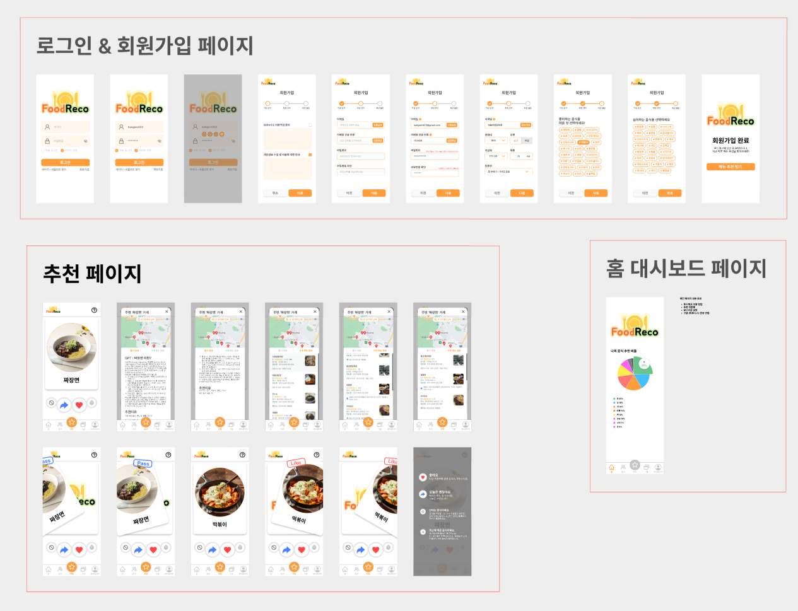

### 목차

| [&nbsp;&nbsp;&nbsp;&nbsp;&nbsp;&nbsp;&nbsp;&nbsp;&nbsp;&nbsp;&nbsp;&nbsp;&nbsp;&nbsp;&nbsp;&nbsp;&nbsp;소개&nbsp;&nbsp;&nbsp;&nbsp;&nbsp;&nbsp;&nbsp;&nbsp;&nbsp;&nbsp;&nbsp;&nbsp;&nbsp;&nbsp;&nbsp;&nbsp;&nbsp;](#소개) | [&nbsp;&nbsp;&nbsp;&nbsp;&nbsp;&nbsp;&nbsp;&nbsp;&nbsp;&nbsp;&nbsp;&nbsp;&nbsp;&nbsp;&nbsp;&nbsp;&nbsp;구현&nbsp;&nbsp;&nbsp;&nbsp;&nbsp;&nbsp;&nbsp;&nbsp;&nbsp;&nbsp;&nbsp;&nbsp;&nbsp;&nbsp;&nbsp;&nbsp;&nbsp;](#구현) | [&nbsp;&nbsp;&nbsp;&nbsp;&nbsp;&nbsp;&nbsp;&nbsp;&nbsp;&nbsp;&nbsp;&nbsp;&nbsp;&nbsp;&nbsp;&nbsp;&nbsp;마치며&nbsp;&nbsp;&nbsp;&nbsp;&nbsp;&nbsp;&nbsp;&nbsp;&nbsp;&nbsp;&nbsp;&nbsp;&nbsp;&nbsp;&nbsp;&nbsp;&nbsp;](#마치며) |
| :-----------------------------------------------------------------------------------------------------------------------------------------------------------------------------------------------------------------------: | :-----------------------------------------------------------------------------------------------------------------------------------------------------------------------------------------------------------------------: | :---------------------------------------------------------------------------------------------------------------------------------------------------------------------------------------------------------------------------: |
|                                                                                              [:balloon: 개요](#balloon-개요)                                                                                              |                                                                                               [:rocket: 기능](#rocket-기능)                                                                                               |                                                                                                    [:boy: 팀원](#boy-팀원)                                                                                                    |
|                                                                               [:sparkles: 프로젝트 기획 배경](#sparkles-프로젝트-기획-배경)                                                                               |                                                                                       [:pizza: 빅데이터 추천](#pizza-빅데이터-추천)                                                                                       |                                                                                                   [:mega: 소감](#mega-소감)                                                                                                   |
|                                                                                  [:deciduous_tree: 빌드 환경](#deciduous_tree-빌드-환경)                                                                                  |                                                                                               [:eyes: 산출물](#eyes-산출물)                                                                                               |                                                                                          [:seedling: 회고 기록](#seedling-회고-기록)                                                                                          |
|                                                                                            [:dart: 기능 설명](#dart-기능-설명)                                                                                            |                                                                                         [:books: 파일 구조도](#books-파일-구조도)                                                                                         |                                                                                                                                                                                                                               |

<br/>
<br/>

# 소개

## :balloon: 개요

**_🖐 SSAFY 9기 2학기 특화 프로젝트 🖐_**  
빅데이터 추천 알고리즘을 사용한 서비스를 개발해보자

> 2023.08.25 ~ 2023.10.06 (6주)

[🔼 목차로 돌아가기](#목차)

<br/>

## :sparkles: 프로젝트 기획 배경

**"오늘 저녁 뭐먹지?"**

> 매일 사람들이 하는 이 고민을 _'빅데이터 추천 알고리즘'_ 을 이용해서 해결해보고자 했습니다.  
> 우리는 주위 친구, 동료들에게 묻곤 하지만, 나의 기분과 경제상황, 최근에 먹은 음식들을 다 고려해서 추천해서 추천하기란 쉽지 않아 금새 실증이 나곤 합니다.

<br/>

**"알아서 내 상황을 고려해 추천해줄 수는 없을까?"**

> 나의 음식 취향, 최근 먹은 메뉴, 오늘 활동량, 알러지, 날씨 등 다양한 요소들을 모두 고려한 하이 태크 추천 시스템을 만들어보고자 했습니다.  
> 서버의 숨겨진 뒷 작업으로는 많은 데이터가 오가지만, 사용자가 보기에는 딱히 귀찮게 입력하는 것 없이 오늘의 메뉴가 추천되는 컨셉입니다.

[🔼 목차로 돌아가기](#목차)

<br/>

## :deciduous_tree: 빌드 환경

| FrontEnd                    | BackEnd                        | Database               | Infra                      |
| :-------------------------- | :----------------------------- | :--------------------- | :------------------------- |
| Node.js 16.18.50            | Java 11 (Oracle jdk : 11.0.20) | MySQL 8.0.33           | AWS EC2 (Ubuntu 20.04 LTS) |
| React.js 18.2.21            | Spring Boot 2.7.15             | MySQL Workbench 8.0 CE | AWS S3 Bucket              |
| react-router-dom 6.14.2     | Gradle 8.2.1                   | Redis 7.2.1            | Nginx 1.18.0               |
| react-toastify 9.1.3        | Spring Security 5.7.10         |                        | Jenkins 2.402              |
| react-hook-form 7.46.1      | JPA & QueryDsl                 |                        | Docker 23.0.6              |
| react-hot-toast 2.4.1       | Hibernate 7.0.5                |                        | Docker Compose 2.17.3      |
| react-icons 4.11.0          | IntelliJ Ultimate 2023.1.3     |                        | SonarQube 10.0.0.68432     |
| react-kakao-maps-sdk 1.1.21 | JWT 4.2.1                      |
| react-modal 3.16.1          | smtp 2.7.0                     |
| react-query 3.39.3          | S3 2.2.1                       |
| Axios 1.5.0                 | lombok 1.18.14                 |
| TypeScript 4.9.5            |                                |
| Recoil 0.7.7                |                                |
| Styled-Components 6.0.8     |                                |
| mui-iconsmaterial 5.14.11   |                                |
| mui-material 5.14.11        |                                |

[🔼 목차로 돌아가기](#목차)

<br>

## :dart: 기능 설명

### PWA를 사용한 어플 구현

- React로 개발했지만 PWA 프로젝트로 빌드해 어플로 사용할 수 있도록 구현했습니다.
- 스마트폰의 GPS 기능을 활용할 수 있었습니다.

### 다양한 요소를 고려한 추천

- 회원가입 시 좋아하는 음식 5가지와 싫어하는 음식 5가지를 선택합니다.
  - 좋아하는 음식은 재료, 조리방식 등을 비교한 유사한 음식을 추천하는 컨텐츠 기반 필터링과 같은 음식을 선택한 다른 사용자의 메뉴를 추천하는 협업 필터링을 적용한 추천에 사용됩니다.
  - 싫어하는 음식은 추천 결과로 나온 메뉴 리스트에서 제외시킵니다.
- 좋아요, 패스, 차단, 상세보기 등 사용자의 명시적/묵시적 피드백을 받아 좋아하는 정도를 판단해 추천에 반영합니다.
  - 좋아요 : 4점
  - 패스 : 2점
  - 상세보기 : 3점
  - 차단 : 1점
  - 최근에 먹음 : 2점
- Google Fitness에서 걸음수 데이터를 받아와 추천에 사용합니다.
  - 사용자의 피드백에 활동량을 포함시키고, 비슷한 활동량에 먹은 음식을 추천하는 방식입니다.
  - 걸음 수 외에도 심박수, 수면 정보도 받아올 수 있어 추후 활용 방안이 많은 API 입니다.

### 위치 기반 음식점 검색

- Kakao Map API를 사용해 현재 메뉴를 검색하고 판매하거나 유사한 음식점을 보여줍니다.
- 지도를 움직이고, 현재 보고있는 창에서 검색이 가능합니다.
  - 초기 값은 현 위치 기준 맵 레벨 7입니다.
- 음식점 리스트를 누르면 해당 음식점 핀이 지도 중앙으로 오게되고, 지도의 핀을 누르면 리스트가 해당 음식점이 최 상단으로 오게 스크롤이 이동합니다.
- 음식점의 전화번호를 누르면 스마트폰의 경우 다이얼 창으로 이동합니다.
- [상세보기]를 누르면 kakao map의 해당 음식점 창으로 이동합니다.

### 친구 추가

- 친구 페이지에서 우측 상단 버튼을 누르면 초대 QR 코드가 나타납니다.
- 카메라로 QR코드를 찍으면 FoodReco 페이지로 이동합니다.
  - 로그인이 안 된 경우는 로그인 페이지로 이동합니다.
  - 로그인이 되어있으면 친구추가가 완료됩니다.
- 추가 된 친구 리스트는 친구 페이지에서 확인할 수 있습니다.

### 그룹 기능

- 그룹 만들기를 누르면 친구들을 초대하고, 그룹 프로필 사진과 그룹 명을 설정해 만들 수 있습니다.
  - 그룹에 초대된 사용자는 리스트에 해당 그룹이 나타나고, 수락을 눌러야합니다.
  - 사용자가 수락을 누르기 전 까지는 그룹원 목록에서 불투명하게 나타납니다.
- 그룹 상세 페이지에서 그룹 메뉴 추천을 시작할 수 있습니다.
  - 그룹 메뉴 추천은 분석 시간을 걸쳐 투표가 시작됩니다. 투표는 모달창으로 나타납니다.
  - 추천으로 나온 메뉴를 그룹원들이 단 하나를 투표해 우선도를 판단할 수 있습니다.
  - SSE 프로토콜을 사용해서 실시간으로 다른 사용자들의 투표 상태를 프로그래스바의 게이지 이동으로 쉽게 알 수 있습니다.
  - 투표는 5분 후 종료됩니다.
- 종료 된 투표는 그룹 상세 페에지 하단에서 기록을 볼 수 있습니다.

<br/>

[🔼 목차로 돌아가기](#목차)

<br/>

# 구현

## :rocket: 기능 시연

|            로그인            |                                         회원가입                                         |                           마이페이지                            |
| :--------------------------: | :--------------------------------------------------------------------------------------: | :-------------------------------------------------------------: |
|   |                                                           |                              |
| - 로그인 시 메인 페이지 이동 | - 이메일 인증 회원가입<br>- 간단한 신체 정보 입력<br>- 콜드 스타트 방지를 위한 음식 선택 | - 프로필 사진 수정<br>- 신체 정보 수정<br>- Google Fitness 연동 |

|                                                               메뉴추천                                                               |                                     친구                                     |                                            그룹                                            |
| :----------------------------------------------------------------------------------------------------------------------------------: | :--------------------------------------------------------------------------: | :----------------------------------------------------------------------------------------: |
|                                                                                                       |                                                       |                                  !                                  |
| - 버튼 : 차단/패스/좋아요/최근먹음<br>- 카드 스와이프 왼쪽 패스, 오른쪽 좋아요<br>- 카드를 누르면 Kakao Map에서 GPS 기준 음식점 검색 | - 친구추가 QR코드 생성<br>- QR코드를 카메라로 찍으면 로그인 후 친구추가 완료 | - 친구 초대해 그룹 생성<br>- 그룹 수락/거부<br>-그룹메뉴추천(투표)<br>-투표 기록 확인 가능 |

[🔼 목차로 돌아가기](#목차)

<br/>

## :pizza: 빅데이터 추천

1. 만개의 레시피 데이터중 음식명 열에서 음식명이 아닌 메뉴를 제거했습니다.

2. 중복되는 음식명의 메뉴를 제거했습니다.

3. 재료가 카테고리형식으로 되어있지 않았기에 재료를 30개로 재한하여 정리했습니다.

4. 재료에는 없지만 음식명에 재료가 포함되어 있는 경우 재료에 추가했습니다.

5. 조리방식, 음식분류1, 음식분류2 열을 통일시켜 정리했습니다.

6. 전처리된 데이터를 기반으로 TF-IDF 모델을 학습시켰습니다.

7. TF-IDF 모델을 활용하여 기준이 되는 음식과 코사인 유사도를 계산하는 방식으로 컨텐츠 기반 추천을 진행했습니다.

[🗂️ 전처리 데이터 보러가기](./fastapi/app/model/indexed_new_ingredient.xlsx)

<br>

[🔼 목차로 돌아가기](#목차)

<br/>

## :eyes: 산출물

### 와이어 프레임


### 목업 디자인




### ERD


### 시스템 구조도


### 간트차트


### 지라 이슈


### 지라 번다운 차트

|            1주차 스프린트             |            2주차 스프린트             |            3주차 스프린트             |
| :-----------------------------------: | :-----------------------------------: | :-----------------------------------: |
|  |  |  |

|            4주차 스프린트             |            5주차 스프린트             |
| :-----------------------------------: | :-----------------------------------: |
|  |  |

### 중간발표 ppt


### 최종발표 ppt


<br>

[🔼 목차로 돌아가기](#목차)

<br/>

## :books: 파일 구조도

### FrontEnd

```
📦frontend
 ┣ 📂public
 ┃ ┣ 📂images
 ┣ 📂src
 ┃ ┣ 📂components
 ┃ ┃ ┣ 📂crewpage
 ┃ ┃ ┣ 📂footer
 ┃ ┃ ┣ 📂friend
 ┃ ┃ ┣ 📂header
 ┃ ┃ ┣ 📂inputs
 ┃ ┃ ┣ 📂membercomponents
 ┃ ┃ ┣ 📂option
 ┃ ┃ ┗ 📂recommend
 ┃ ┣ 📂fonts
 ┃ ┣ 📂hooks
 ┃ ┣ 📂model
 ┃ ┣ 📂pages
 ┃ ┃ ┣ 📂crew
 ┃ ┃ ┣ 📂crewRecomendation
 ┃ ┃ ┣ 📂friend
 ┃ ┃ ┣ 📂login
 ┃ ┃ ┣ 📂main
 ┃ ┃ ┣ 📂member
 ┃ ┃ ┣ 📂memberRecommendation
 ┃ ┃ ┣ 📂notfound
 ┃ ┃ ┣ 📂singup
 ┃ ┣ 📂recoil
 ┃ ┃ ┗ 📂atoms
 ┃ ┣ 📂redux
 ┃ ┃ ┣ 📂slices
 ┃ ┃ ┗ 📂store
 ┃ ┣ 📂styles
 ┃ ┣ 📂utils
```

### BackEnd

```
📦backend
 ┣ 📂src
 ┃ ┗ 📂main
 ┃ ┃ ┗ 📂java
 ┃ ┃ ┃ ┗ 📂com
 ┃ ┃ ┃ ┃ ┗ 📂ssafy
 ┃ ┃ ┃ ┃ ┃ ┗ 📂special
 ┃ ┃ ┃ ┃ ┃ ┃ ┣ 📂config
 ┃ ┃ ┃ ┃ ┃ ┃ ┣ 📂controller
 ┃ ┃ ┃ ┃ ┃ ┃ ┣ 📂domain
 ┃ ┃ ┃ ┃ ┃ ┃ ┃ ┣ 📂crew
 ┃ ┃ ┃ ┃ ┃ ┃ ┃ ┣ 📂etc
 ┃ ┃ ┃ ┃ ┃ ┃ ┃ ┣ 📂food
 ┃ ┃ ┃ ┃ ┃ ┃ ┃ ┗ 📂member
 ┃ ┃ ┃ ┃ ┃ ┃ ┣ 📂dto
 ┃ ┃ ┃ ┃ ┃ ┃ ┃ ┣ 📂request
 ┃ ┃ ┃ ┃ ┃ ┃ ┃ ┣ 📂response
 ┃ ┃ ┃ ┃ ┃ ┃ ┣ 📂exception
 ┃ ┃ ┃ ┃ ┃ ┃ ┣ 📂repository
 ┃ ┃ ┃ ┃ ┃ ┃ ┃ ┣ 📂crew
 ┃ ┃ ┃ ┃ ┃ ┃ ┃ ┣ 📂etc
 ┃ ┃ ┃ ┃ ┃ ┃ ┃ ┣ 📂food
 ┃ ┃ ┃ ┃ ┃ ┃ ┃ ┣ 📂member
 ┃ ┃ ┃ ┃ ┃ ┃ ┣ 📂security
 ┃ ┃ ┃ ┃ ┃ ┃ ┃ ┣ 📂filter
 ┃ ┃ ┃ ┃ ┃ ┃ ┃ ┣ 📂handler
 ┃ ┃ ┃ ┃ ┃ ┃ ┃ ┗ 📂service
 ┃ ┃ ┃ ┃ ┃ ┃ ┣ 📂service
 ┃ ┃ ┃ ┃ ┃ ┃ ┃ ┣ 📂crew
 ┃ ┃ ┃ ┃ ┃ ┃ ┃ ┣ 📂etc
 ┃ ┃ ┃ ┃ ┃ ┃ ┃ ┣ 📂food
 ┃ ┃ ┃ ┃ ┃ ┃ ┃ ┗ 📂member
 ┃ ┃ ┃ ┃ ┃ ┃ ┣ 📂util

 📦fastapi
 ┣ 📂app
 ┃ ┣ 📂model

 📦dataproccess
 ┣ 📂food_process
 ┃ ┣ 📂model
 ┃ ┣ 📂preprocessed_data
 ┃ ┃ ┣ 📂food_calorie
 ┃ ┃ ┗ 📂menu_ingredient
```

[🔼 목차로 돌아가기](#목차)

<br/>

# 마치며

## :boy: 팀원

| [강수민(팀장)](https://github.com/Jade-Good) | [김동우](https://github.com/dongwoo46) | [이대건](https://github.com/leedaegeon) | [임규돈](https://github.com/KyuDonLim) | [조준희](https://github.com/jjunehee) |
| :------------------------------------------: | :------------------------------------: | :-------------------------------------: | :------------------------------------: | :-----------------------------------: |
|                   |             |              |             |            |
|                FrontEnd<br>PM                |                FrontEnd                |            BackEnd<br>RecSys            |          BackEnd<br>DataBase           |           BackEnd<br>Infra            |

### 팀원 역할

**_FrontEnd_**

- 강수민
  - 디자인 : 로그인 페이지, 친구 페이지, 추천 페이지, 그룹 페이지
  - 컴포넌트 디자인 구현 : 친구 페이지, 추천 페이지, 그룹 페이지
  - API 연결 및 구현
    - 개인 메뉴 추천
    - 카카오맵API 위치 기반 검색
      - 현 위치 재검색
      - 검색 결과 리스트 및 클릭 시 맵, 스크롤 이동
    - 카드 스와이프 애니메이션
    - 개인 메뉴 피드백
    - QR 생성
    - 그룹 리스트
    - 그룹 상세 페이지
      - 그룹 멤버 표시
      - 그룹 초대 수락/거부
      - 그룹 메뉴 추천 시작 : SSE
      - 투표 진행(모달)
      - 투표 기록 확인 (모달)
- 김동우
  - 디자인 : 회원가입, 메인 페이지
  - 컴포넌트 디자인 구현 : 로그인 페이지, 회원가입, 메인 페이지
  - API 연결 및 구현
    - axios intercepter : JWT
    - react router 페이지 전환
    - 회원가입 / 로그인
      - react hook form
      - 이메일 인증
      - 정규표현식 입력 제한
    - 친구 페이지
    - 그룹 생성
    - 메인 페이지 워드 클라우드, 다이어그램
    - 마이페이지 회원 정보 수정

**_BackEnd_**

- 이대건
  - ERD 설계
  - 음식 빅데이터 전처리
  - fastAPI를 활용하여 추천 시스템 개발
  - spring boot와 fastAPI 통신
  - spring 서버에서 추천 결과 후처리(필터링)
  - 구글 OAuth2.0 권한 연동
  - google fitness API를 통해 유저 걸음 정보 수집
- 임규돈
  - 추천 서비스
  - 음식 데이터 전처리
    - 자연어 음식 재료 데이터 전처리
    - 조리 방식, 종류, 분류 별 데이터 전처리
  - 데이터베이스
    - 데이터베이스 설계
      - ERD 설계
      - 관계 설정
      - 데이터베이스 타임 설정 관리
    - 데이터베이스 구현
      - 설계된 데이터베이스 JPA를 사용한 구현
  - 프로젝트 기본 설정 구현
    - JPA를 활용하여 Entity 구현
    - 프로젝트 기본 구조 구현
  - API 설계 및 구현
    - 로그인 API 구현
      - Spring Security를 사용한 로그인 API 구현
    - 친구 API 구현
      - 친구 추가 API 구현
      - 친구 리스트 API 구현
    - 그룹 API 구현
      - 사용자 그룹 리스트를 반환하는 API 구현
        - 그룹 사진 및 제목, 최근 추천받았던 일시에 대한 정보 제공
      - 사용자 그룹 생성 API 구현
        - 친구들을 그룹에 초대하여 생성
      - 사용자 그룹 초대 API 구현
        - 다른 사람이 초대한 그룹을 수락 또는 거절 가능
        - 거절 시 해당 그룹 변경하지 않음
      - 사용자 그룹 상세 정보 API 구현
        - 그룹에 대한 사진과 제목에 대한 그룹 정보 제공
        - 그룹원들의 상태와 이미지에 대한 정보 제공
        - 그룹에서 받았던 히스토리 내역 제공
      - 사용자 그룹 투표 API 구현
        - 그룹 내 사용자의 정보를 통해 추천 음식 리스트 제공
        - sse를 사용하여 해당 그룹 상태 변경 확인
        - 투표 시 sse 이벤트로 그룹 사용자에게 정보 제공
        - 투표 시작, 추천 분석 중, 투표 중, 투표 종료에 따른 이벤트 발송
      - 사용자 그룹 추천 히스토리 API 구현
        - 추천 받았던 음식 리스트 제공
        - 자신이 투표했던 음식 정보 제공
- 조준희

  - 이메일 인증
    - Redis : 이메일 인증 번호 생성 및 검증 DB
    - smtp : 발급된 인증번호 송신
  - ERD 설계
  - 데이터 전처리 : 음식 카테고리 분류
  - API 구현
    - 마이페이지 : 회원정보 조회, 수정
    - 회원가입 : 이메일, 닉네임, 인증번호 확인
    - S3 이미지 : 개인, 음식, 그룹 사진 Get, Put

**_Infra_**

- 조준희
  - 시스템 구조 설계
    - Docker, Docker compose, Jenkins, nginx
    - SSL 인증 : Cerbot
    - CI/CD : webhook, pipeline 구축
  - 클라우드
    - S3 : IAM, Bucket 생성, 음식 사진 DB 구축
    - Image Crawling : Selenium 사용한 구글 음식 사진 수집

[🔼 목차로 돌아가기](#목차)

<br/>

## :mega: 소감

**_수민_**

> 프론트를 처음 담당하며 새로 배울 것도 많았고, 아이디어 선정도 늦어져 일정이 정말 타이트 했던 프로젝트였습니다. 후반부에는 프로젝트를 진행하며 처음으로 포기하고 싶은 생각이 들정도로 집중 개발을 했는데, 끝까지 포기하지 않고 프로젝트 개발을 위해 노력했습니다. 새롭게 접하는 분야라고 너무 어렵다고 걱정만 하는 게 아니라, 도전적으로 기술을 접하고 사용하는게 좋은 경험이 된 것 같습니다.  
> 디자인 부분도 대부분 담당했는데, 팀원들의 피드백을 받고 수용하는게 정말 중요하다는 것을 배울 수 있었습니다. 혼자서 아무리 고민한다고 해도, 해결되지 않거나 비효율적인 진행이 되어버린다는 걸 깨닫고, 피드백을 적극적으로 진행했습니다.  
> 빅데이터 추천을 포함해 지도 API, SSE 통신, 카드 스와이프 등 구현 욕심이 났던 부분들이 제 기능을 하게되어서 정말 뿌듯하게 프로젝트를 마무리 할 수 있었습니다.  
> 백엔드를 지망하지만, 프론트에서도 배울점이 많다는 생각이 들었고 관련 기술들을 학습하고 구현하면서 전체적인 개발 실력도 크게 향상 시킬 수 있었던 것 같습니다.  
> 타이트한 일정과 처음 맡는 프론트 파트를 뒤로하고 팀장과 PM 역할도 진행했어야 했는데, 팀원들이 적극적으로 의견을 내주고 먼저 일을 맡아 해결하는 등 많은 도움을 주어서 부담을 많이 덜 수 있었습니다. 앞으로의 개발도 팀원들을 믿고 뜻깊게 진행할 수 있을 것 같습니다.  
> 1명 없는 5인팀으로 고생한 우리 팀 파이팅!

**_동우_**

> 이전 프로젝트때 코드가 굉장히 복잡했는데 이러한 코드를 해결하기 위해 새로운 라이브러리를 도입하여 클린코드를 일부 성취했다고 생각합니다. 새로운 시도, 도전하는 용기를 배웠고, 마지막까지 성공하기 위해 끝까지 끊임없이 수행 할 생각입니다.

**_규돈_**

> 데이터 수집부터 추천 알고리즘까지 모든 것을 해보는 것은 처음이었지만 같이 진행하는 팀원들과 많은 이야기를 하여 구현할 수 있었습니다. 또한
> 과거 사용했지만 문제가 있었던 sse 기능을 문제없이 사용할 수 있었던 것이 좋았습니다. 아쉬웠던 점은 프로젝트 기획 단계가 너무 길었던 감이 있
> 었습니다. 그에 따라 개발 시간이 적어졌고 완성도가 떨어진 점이 아쉬웠습니다. 이번 프로젝트로 일정관리에 대한 중요도를 많이 깨달았고, 문제가
> 발생했을 때 해결하기 위해 팀원들과 소통하는 법을 배울 수 있어서 좋았습니다.

**_준희_**

> 처음 접해보는 인프라를 구축해보며 실제로 서비스를 운영할때 개발, 유지보수, 배포가 어떤 프로세스로 진행되는지 제대로 파악할 수 있었습니다.
> 또한 Jira, 마일스톤, 스프린트 회의, 회고를 최대한 활용하여 프로젝트를 진행했던 것이 프로젝트 성과에 있어 중요한 역할이 될 수 있다는 사실을 깨달았습니다.

**_대건_**

> 빅데이터 처리를 주먹구구식이 맞는지 아닌지 확신을 가지지 못한 채로 진행했지만 전문가 미팅을 통해 방향을 잡을 수 있었습니다.
> 팀원과 끊임없는 회의를 가져 서로 믿고 의지하며 프로젝트를 진행 할 수 있어서 팀 프로젝트의 의의를 알게되었습니다.
> 결국 최종 오픈 일자에 맞출 수 있어 뿌듯한 프로젝트였습니다.

[🔼 목차로 돌아가기](#목차)

<br/>

## :seedling: 회고 기록

### [🔷 데일리 회고](./agile/데일리%20회고)

- [강수민 개인 회고](./agile/데일리%20회고/kangsoomin/README.md)

- [김동우 개인 회고](./agile/데일리%20회고/kimdongwoo/Readme.md)

- [이대건 개인 회고](./agile/데일리%20회고/leedaegeon/Readme.md)

- [임규돈 개인 회고](./agile/데일리%20회고/limkyudon/README.md)

- [조준희 개인 회고](./agile/데일리%20회고/chojunhee/README.md)

### [🔷 스크럼](./agile/scrum/)

### [🔷 스프린트 회고](./agile/스프린트%20회고/)

<br/>

[🔼 목차로 돌아가기](#목차)
