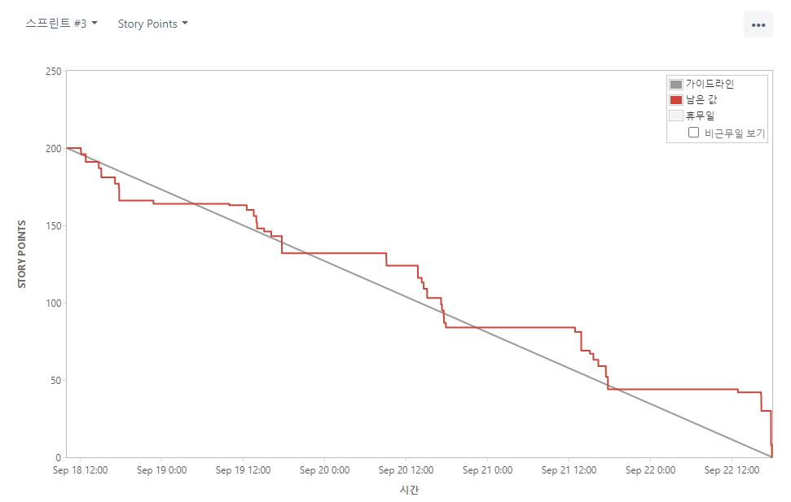

### 목차

| [&nbsp;&nbsp;&nbsp;&nbsp;&nbsp;&nbsp;&nbsp;&nbsp;&nbsp;&nbsp;&nbsp;&nbsp;&nbsp;&nbsp;&nbsp;&nbsp;&nbsp;소개&nbsp;&nbsp;&nbsp;&nbsp;&nbsp;&nbsp;&nbsp;&nbsp;&nbsp;&nbsp;&nbsp;&nbsp;&nbsp;&nbsp;&nbsp;&nbsp;&nbsp;](#소개) | [&nbsp;&nbsp;&nbsp;&nbsp;&nbsp;&nbsp;&nbsp;&nbsp;&nbsp;&nbsp;&nbsp;&nbsp;&nbsp;&nbsp;&nbsp;&nbsp;&nbsp;구현&nbsp;&nbsp;&nbsp;&nbsp;&nbsp;&nbsp;&nbsp;&nbsp;&nbsp;&nbsp;&nbsp;&nbsp;&nbsp;&nbsp;&nbsp;&nbsp;&nbsp;](#구현) | [&nbsp;&nbsp;&nbsp;&nbsp;&nbsp;&nbsp;&nbsp;&nbsp;&nbsp;&nbsp;&nbsp;&nbsp;&nbsp;&nbsp;&nbsp;&nbsp;&nbsp;마치며&nbsp;&nbsp;&nbsp;&nbsp;&nbsp;&nbsp;&nbsp;&nbsp;&nbsp;&nbsp;&nbsp;&nbsp;&nbsp;&nbsp;&nbsp;&nbsp;&nbsp;](#마치며) |
| :-----------------------------------------------------------------------------------------------------------------------------------------------------------------------------------------------------------------------: | :-----------------------------------------------------------------------------------------------------------------------------------------------------------------------------------------------------------------------: | :---------------------------------------------------------------------------------------------------------------------------------------------------------------------------------------------------------------------------: |
|                                                                                                    [🎈 개요](#🎈-개요)                                                                                                    |                                                                                                    [🚀 기능](#🚀-기능)                                                                                                    |                                                                                                      [👦 팀원](#👦-팀원)                                                                                                      |
|                                                                                      [✨ 프로젝트 기획 배경](#✨-프로젝트-기획-배경)                                                                                      |                                                                                           [🍕 빅데이터 추천](#🍕-빅데이터-추천)                                                                                           |                                                                                                      [📣 소감](#📣-소감)                                                                                                      |
|                                                                                               [🌳 빌드 환경](#🌳-빌드-환경)                                                                                               |                                                                                                  [👀 산출물](#👀-산출물)                                                                                                  |                                                                                                                                                                                                                               |
|                                                                                             [🎯 기술 차별점](#🎯-기술-차별점)                                                                                             |                                                                                             [📚 파일 구조도](#📚-파일-구조도)                                                                                             |                                                                                                                                                                                                                               |

<br/>
<br/>

# 소개

## 🎈 개요

**_🖐 SSAFY 9기 2학기 특화 프로젝트 🖐_**  
빅데이터 추천 알고리즘을 사용한 서비스를 개발해보자

> 2023.08.25 ~ 2023.10.06 (6주)

[🔼 목차로 돌아가기](#목차)

<br/>

## ✨ 프로젝트 기획 배경

**"오늘 저녁 뭐먹지?"**

> 매일 사람들이 고민하는 이 고민을 _'빅데이터 추천 알고리즘'_ 을 이용해서 해결해보고자 했습니다.  
> 우리는 주위 친구, 동료들에게 묻곤 하지만, 나의 기분과 경제상황, 최근에 먹은 음식들을 다 고려해서 추천해서 추천하기란 쉽지 않아 금새 실증이 나곤 합니다.

<br/>

**"알아서 내 상황을 고려해 추천해줄 수는 없을까?"**

> 나의 음식 취향, 최근 먹은 메뉴, 오늘 활동량, 알러지, 날씨 등 다양한 요소들을 모두 고려한 하이 태크 추천 시스템을 만들어보고자 했습니다.  
> 서버의 숨겨진 뒷 작업으로는 많은 데이터가 오가지만, 사용자가 보기에는 딱히 귀찮게 입력하는 것 없이 오늘의 메뉴가 추천되는 컨셉입니다.

[🔼 목차로 돌아가기](#목차)

<br/>

## 🌳 빌드 환경

| FrontEnd                    | BackEnd                        | Database               | Infra                      |
| :-------------------------- | :----------------------------- | :--------------------- | :------------------------- |
| Node.js 16.18.50            | Java 11 (Oracle jdk : 11.0.20) | MySQL 8.0.33           | AWS EC2 (Ubuntu 20.04 LTS) |
| React.js 18.2.21            | Spring Boot 2.7.15             | MySQL Workbench 8.0 CE | AWS S3 Bucket              |
| react-router-dom 6.14.2     | Gradle 8.2.1                   | Redis 7.2.1            | Nginx 1.18.0               |
| react-toastify 9.1.3        | Spring Security 5.7.10         |                        | Jenkins 2.402              |
| react-hook-form 7.46.1      | JPA & QueryDsl                 |                        | Docker 23.0.6              |
| react-hot-toast 2.4.1       | Hibernate 7.0.5                |                        | Docker Compose 2.17.3      |
| react-icons 4.11.0          | IntelliJ Ultimate 2023.1.3     |                        | SonarQube 10.0.0.68432     |
| react-kakao-maps-sdk 1.1.21 | JWT 4.2.1                      |
| react-modal 3.16.1          | smtp 2.7.0                     |
| react-query 3.39.3          | S3 2.2.1                       |
| Axios 1.5.0                 | lombok 1.18.14                 |
| TypeScript 4.9.5            |                                |
| Recoil 0.7.7                |                                |
| Styled-Components 6.0.8     |                                |
| mui-iconsmaterial 5.14.11   |                                |
| mui-material 5.14.11        |                                |

[🔼 목차로 돌아가기](#목차)

<br/>

## 🎯 기술 차별점

[🔼 목차로 돌아가기](#목차)

<br/>

# 구현

## 🚀 기능

|           로그인            |            회원가입             |             마이페이지              |
| :-------------------------: | :-----------------------------: | :---------------------------------: |
|  |  |  |
|         로그인 <br>         |            회원가입             |             마이페이지              |

|            메뉴추천             |          친구           |          그룹           |
| :-----------------------------: | :---------------------: | :---------------------: |
|  |  |  |
|            메뉴추천             |        친구추가         |        그룹기능         |

[🔼 목차로 돌아가기](#목차)

<br/>

## 🍕 데이터 전처리 및 빅데이터 추천 알고리즘

### 1. 만개의 레시피 데이터중 음식명 열에서 음식명이 아닌 음식 제거

### 2. 중복되는 음식명 제거

### 3. 재료가 카테고리형식으로 되어있지 않았기에 재료를 30개로 재한하여 정리

### 4. 재료에는 없지만 음식명에 재료가 포함되어 있는 경우 재료에 추가

### 5. 조리방식, 음식분류1, 음식분류2 열을 통일시켜 정리

### 6. 전처리된 데이터를 기반으로 TF-IDF 모델을 학습시킨다.

### 7. TF-IDF 모델을 활용하여 기준이 되는 음식과 코사인 유사도를 계산하는 방식으로 컨텐츠 기반 추천을 진행한다.

### [🗂️ 전처리 데이터 보러가기](./fastapi/app/model/indexed_new_ingredient.xlsx)

[🔼 목차로 돌아가기](#목차)

<br/>

## 👀 산출물

### 와이어 프레임, 디자인, 목업

### ERD


### 시스템 구조도


### 간트차트


### 지라 이슈


### 지라 번다운 차트

|            1주차 스프린트             |            2주차 스프린트             |            3주차 스프린트             |
| :-----------------------------------: | :-----------------------------------: | :-----------------------------------: |
|  |  |  |

|            4주차 스프린트             |            5주차 스프린트             |
| :-----------------------------------: | :-----------------------------------: |
|  |  |

### 중간발표 ppt


### 최종발표 ppt


[🔼 목차로 돌아가기](#목차)

<br/>

## 📚 파일 구조도

### FrontEnd

```
📦frontend
 ┣ 📂public
 ┃ ┣ 📂images
 ┣ 📂src
 ┃ ┣ 📂components
 ┃ ┃ ┣ 📂crewpage
 ┃ ┃ ┣ 📂footer
 ┃ ┃ ┣ 📂friend
 ┃ ┃ ┣ 📂header
 ┃ ┃ ┣ 📂inputs
 ┃ ┃ ┣ 📂membercomponents
 ┃ ┃ ┣ 📂option
 ┃ ┃ ┗ 📂recommend
 ┃ ┣ 📂fonts
 ┃ ┣ 📂hooks
 ┃ ┣ 📂model
 ┃ ┣ 📂pages
 ┃ ┃ ┣ 📂crew
 ┃ ┃ ┣ 📂crewRecomendation
 ┃ ┃ ┣ 📂friend
 ┃ ┃ ┣ 📂login
 ┃ ┃ ┣ 📂main
 ┃ ┃ ┣ 📂member
 ┃ ┃ ┣ 📂memberRecommendation
 ┃ ┃ ┣ 📂notfound
 ┃ ┃ ┣ 📂singup
 ┃ ┣ 📂recoil
 ┃ ┃ ┗ 📂atoms
 ┃ ┣ 📂redux
 ┃ ┃ ┣ 📂slices
 ┃ ┃ ┗ 📂store
 ┃ ┣ 📂styles
 ┃ ┣ 📂utils
```

### BackEnd

```
📦backend
 ┣ 📂src
 ┃ ┗ 📂main
 ┃ ┃ ┗ 📂java
 ┃ ┃ ┃ ┗ 📂com
 ┃ ┃ ┃ ┃ ┗ 📂ssafy
 ┃ ┃ ┃ ┃ ┃ ┗ 📂special
 ┃ ┃ ┃ ┃ ┃ ┃ ┣ 📂config
 ┃ ┃ ┃ ┃ ┃ ┃ ┣ 📂controller
 ┃ ┃ ┃ ┃ ┃ ┃ ┣ 📂domain
 ┃ ┃ ┃ ┃ ┃ ┃ ┃ ┣ 📂crew
 ┃ ┃ ┃ ┃ ┃ ┃ ┃ ┣ 📂etc
 ┃ ┃ ┃ ┃ ┃ ┃ ┃ ┣ 📂food
 ┃ ┃ ┃ ┃ ┃ ┃ ┃ ┗ 📂member
 ┃ ┃ ┃ ┃ ┃ ┃ ┣ 📂dto
 ┃ ┃ ┃ ┃ ┃ ┃ ┃ ┣ 📂request
 ┃ ┃ ┃ ┃ ┃ ┃ ┃ ┣ 📂response
 ┃ ┃ ┃ ┃ ┃ ┃ ┣ 📂exception
 ┃ ┃ ┃ ┃ ┃ ┃ ┣ 📂repository
 ┃ ┃ ┃ ┃ ┃ ┃ ┃ ┣ 📂crew
 ┃ ┃ ┃ ┃ ┃ ┃ ┃ ┣ 📂etc
 ┃ ┃ ┃ ┃ ┃ ┃ ┃ ┣ 📂food
 ┃ ┃ ┃ ┃ ┃ ┃ ┃ ┣ 📂member
 ┃ ┃ ┃ ┃ ┃ ┃ ┣ 📂security
 ┃ ┃ ┃ ┃ ┃ ┃ ┃ ┣ 📂filter
 ┃ ┃ ┃ ┃ ┃ ┃ ┃ ┣ 📂handler
 ┃ ┃ ┃ ┃ ┃ ┃ ┃ ┗ 📂service
 ┃ ┃ ┃ ┃ ┃ ┃ ┣ 📂service
 ┃ ┃ ┃ ┃ ┃ ┃ ┃ ┣ 📂crew
 ┃ ┃ ┃ ┃ ┃ ┃ ┃ ┣ 📂etc
 ┃ ┃ ┃ ┃ ┃ ┃ ┃ ┣ 📂food
 ┃ ┃ ┃ ┃ ┃ ┃ ┃ ┗ 📂member
 ┃ ┃ ┃ ┃ ┃ ┃ ┣ 📂util

 📦fastapi
 ┣ 📂app
 ┃ ┣ 📂model

 📦dataproccess
 ┣ 📂food_process
 ┃ ┣ 📂model
 ┃ ┣ 📂preprocessed_data
 ┃ ┃ ┣ 📂food_calorie
 ┃ ┃ ┗ 📂menu_ingredient
```

[🔼 목차로 돌아가기](#목차)

<br/>

# 마치며

## 👦 팀원

| [강수민(팀장)](https://github.com/Jade-Good) |     [김동우](#👦-팀원)      | [이대건](https://github.com/leedaegeon) | [임규돈](https://github.com/KyuDonLim) | [조준희](https://github.com/jjunehee) |
| :------------------------------------------: | :-------------------------: | :-------------------------------------: | :------------------------------------: | :-----------------------------------: |
|                   |  |              |             |            |
|                   FE / PM                    |             FE              |               BE / RecSys               |                 BE /DB                 |              BE / Infra               |

### 팀원 역할

**_FrontEnd_**

- 강수민
  - 디자인
  - 컴포넌트
- 김동우

**_BackEnd_**

- 이대건
  - 음식 빅데이터 전처리
  - fastAPI를 활용하여 추천 시스템 개발
  - spring boot와 fastAPI 통신
  - spring 서버에서 추천 결과 후처리(필터링)
  - 구글 OAuth2.0 권한 연동
  - google fitness API를 통해 유저 걸음 정보 수집
- 임규돈
- 조준희

**_Infra_**

- 조준희

[🔼 목차로 돌아가기](#목차)

<br/>

## 📣 소감

**_수민_**

> 끝까지 포기하지 않고 프로젝트 개발을 위해 노력했습니다. 새롭게 접하는 분야라고 너무 어렵다고 걱정만 하는 게 아니라, 도전적으로 기술을 접하고 사용하는게 좋은 경험이 된 것 같습니다. 디자인에서 특히 느꼈지만, 팀원들의 피드백을 받고 수용하는게 정말 중요한 것 같습니다.

**_동우_**

> 이전 프로젝트때 코드가 굉장히 복잡했는데 이러한 코드를 해결하기 위해 새로운 라이브러리를 도입하여 클린코드를 일부 성취했다고 생각함. 새로운 시도, 도전하는 용기. 끝맺음, 성공하기 위해 끝까지 끊임없이 수행

**_규돈_**

> 팀원들 설득해서라도 프로젝트의 완성도를 위해 노력하기. 개발할 때에 최대한의 상황을 고려하여 코드 작성을 하여 발생할 수 있는 모든 경우의 수에 대한 처리를 해 놓는 것이 좋았습니다. 같이 작업하는 팀원의 피드백을 바탕으로 더 나은 정보를 제공하는 것이 좋다.

**_준희_**

> 그래도 프로젝트가 서비스는 가능한 수준으로 완성했다. 팀원들과 많은 의견을 나누며 프로젝트를 진행했다.

**_대건_**

> 일정을 맞추는 것은 굉장히 중요한 일임을 알게되었다. 안될것 같은 오픈을 어찌저찌 해냈다. 구글 oauth, fastapi, jpa 처음 사용하는 기술을 사용하는 경험이 좋았다. 앞으로도 더 많은 기술을 찾아보자

[🔼 목차로 돌아가기](#목차)

<br/>
